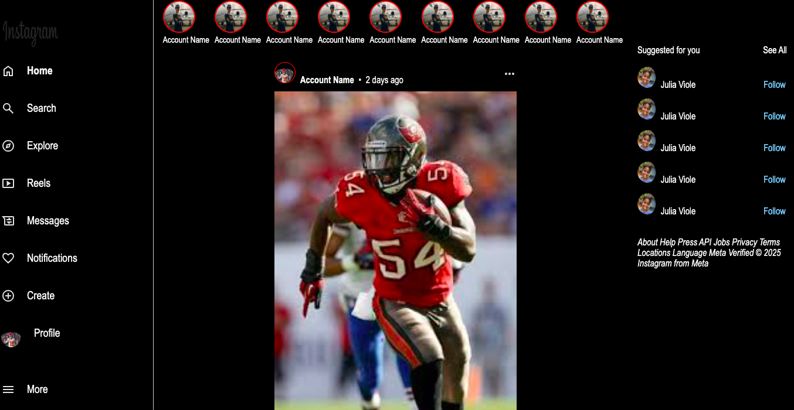

# Instagram Mock App

### After learning flexbox and grid I wanted to make a project which used that a lot to practice what I learned. After using a youtube tutorial to make a YouTube Mock App, I wanted to see if I could make one all by myself, so I tried to make this Instagram Mock App. I also wanted to get better at using side navbars.

### I used side navbars on the left and right to add nav icons and the ability to see other users, respectively. I also added a header on the top to see other users stories. And finally, the main posts are on the center of the screen using flexbox to position them properly.

